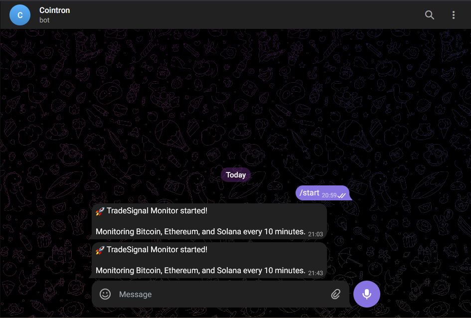
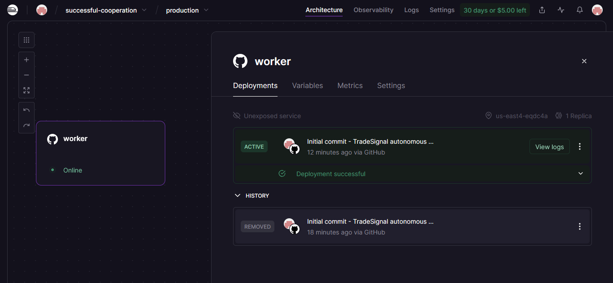
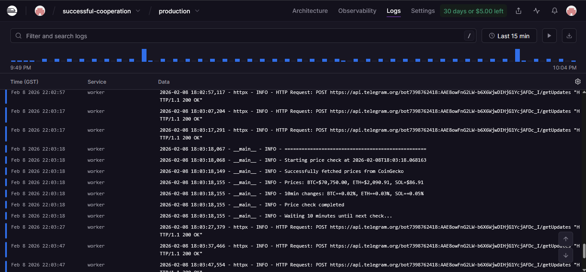
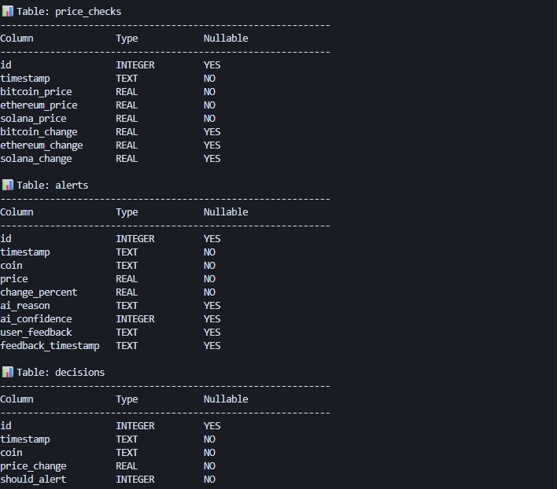

# TradeSignal - Autonomous Crypto Monitoring Agent

> **A production-ready, AI-powered cryptocurrency monitoring system built with modern development practices. Fully autonomous, self-learning, and deployed in production.**

[](https://railway.app)
[](https://www.python.org/)
[](LICENSE)

## 🟢 Live Status

**Status:** 🟢 Running in production on Railway

This autonomous agent has been monitoring cryptocurrency markets 24/7, making intelligent decisions about when to alert users based on AI analysis and historical feedback patterns.

---

## 📊 Metrics

| Metric | Value |
|--------|-------|
| **Deployment Date** | *[To be updated]* |
| **Total Runtime** | *[To be updated]* |
| **Price Checks Performed** | *[To be updated]* |
| **AI Decisions Made** | *[To be updated]* |
| **Alerts Sent** | *[To be updated]* |
| **Uptime Percentage** | *[To be updated]* |

*Metrics are tracked in real-time and stored in the SQLite database.*

---

## 🚀 Overview

TradeSignal is a fully autonomous cryptocurrency monitoring system that combines real-time price tracking, AI-powered decision making, and user feedback learning. Built from scratch with production-ready practices, it demonstrates:

- **Autonomous Operation**: Runs continuously without human intervention
- **AI-First Architecture**: Uses Google Gemini AI for intelligent alert decisions
- **Self-Learning System**: Improves over time based on user feedback
- **Production Deployment**: Live on Railway with comprehensive error handling
- **Zero-Cost Operation**: Built entirely with free-tier APIs

### Key Features

- ⚡ **Real-Time Monitoring**: Checks Bitcoin, Ethereum, and Solana prices every 10 minutes
- 🤖 **AI-Powered Decisions**: Gemini AI analyzes price movements and decides when alerts are valuable
- 📱 **Telegram Integration**: Sends formatted alerts with interactive feedback buttons
- 📈 **Learning System**: Uses 👍/👎 feedback to improve future alert quality
- 🛡️ **Production Ready**: Comprehensive error handling, retry logic, and graceful shutdown
- 💰 **100% Free**: Uses only free APIs (Gemini, CoinGecko, Telegram)

---

## 🏗️ Architecture

```
┌─────────────────────────────────────────────────────────────┐
│                    TradeSignal System                        │
└─────────────────────────────────────────────────────────────┘
                              │
                              ▼
        ┌─────────────────────────────────────┐
        │      monitor.py (Main Loop)         │
        │  • Runs every 10 minutes            │
        │  • Orchestrates all components      │
        │  • Handles graceful shutdown        │
        └─────────────────────────────────────┘
                    │
        ┌───────────┼───────────┐
        │           │           │
        ▼           ▼           ▼
┌───────────┐ ┌───────────┐ ┌───────────┐
│ CoinGecko │ │  Gemini   │ │ Telegram  │
│   API     │ │    AI     │ │    Bot    │
│           │ │           │ │           │
│ • Fetch   │ │ • Analyze │ │ • Send    │
│   prices  │ │   changes │ │   alerts  │
│ • 24h     │ │ • Decide  │ │ • Handle  │
│   trends  │ │   alerts  │ │   feedback│
└───────────┘ └───────────┘ └───────────┘
        │           │           │
        └───────────┼───────────┘
                    │
                    ▼
        ┌───────────────────────┐
        │   SQLite Database     │
        │                        │
        │ • price_checks         │
        │ • alerts               │
        │ • decisions            │
        │ • feedback_history     │
        └───────────────────────┘
```

### System Flow

1. **Price Fetching** → CoinGecko API provides current prices and 24h trends
2. **Change Detection** → System calculates 10-minute price changes
3. **AI Analysis** → Gemini AI evaluates if alert is warranted (considers magnitude, correlation, user feedback history)
4. **Decision Storage** → All AI decisions logged for analysis
5. **Alert Delivery** → If approved, formatted message sent via Telegram
6. **Feedback Loop** → User feedback stored and used to improve future decisions

---

## 🤖 Built with AI-First Development

This project was developed using **Cursor**, an AI-powered code editor, demonstrating modern AI-assisted development practices. The entire system was built with:

- **Rapid Prototyping**: From concept to production in hours, not days
- **AI-Assisted Architecture**: Leveraged AI to design clean, maintainable code structure
- **Intelligent Code Generation**: Used AI to generate boilerplate, error handling, and integration code
- **Iterative Refinement**: Continuously improved code quality through AI suggestions

**Development Highlights:**
- Complete system architecture designed with AI assistance
- All API integrations (CoinGecko, Gemini, Telegram) implemented with AI guidance
- Database schema and operations designed for scalability
- Production-ready error handling and logging throughout
- Deployment configuration optimized for Railway platform

This demonstrates proficiency in:
- **AI-Augmented Development**: Effectively using AI tools to accelerate development
- **Modern Workflows**: Adapting to new development paradigms
- **Rapid Delivery**: Building production systems quickly without sacrificing quality

---

## 💡 What I Learned

*I learnt how amazing it is to work with AI, and how much can essentially be done using all the amazing features and resources available on the internet. This timeline is where we utilize AI to build and deploy code using AI fast and efficiently.*

---

## 📸 Screenshots

### Telegram Alert Interface

*Interactive alert with feedback buttons sent directly to Telegram*

### Railway Deployment Dashboard

*Production deployment on Railway showing active monitoring and logs*

### System Logs

*Autonomous operation logs showing price checks, AI decisions, and alert delivery*

### Database Schema and Sample Data

*Database structure showing tables (price_checks, alerts, decisions) with sample data*

*To view the database schema and sample data, you have several options:*

**Option 1: Use the built-in viewer script (Recommended)**
```bash
python view_database.py
```
This will display the schema, sample data, and statistics in a formatted view perfect for screenshots.

**Option 2: Use DB Browser for SQLite (GUI)**
1. Install [DB Browser for SQLite](https://sqlitebrowser.org/) (free, cross-platform)
2. Open `tradesignal.db` in DB Browser
3. Navigate to "Database Structure" tab to see schema
4. Browse tables (`price_checks`, `alerts`, `decisions`) to see sample data
5. Take a screenshot of the database structure and data

**Option 3: Command line**
```bash
sqlite3 tradesignal.db ".schema"  # View schema
sqlite3 tradesignal.db "SELECT * FROM alerts LIMIT 5;"  # View sample alerts
```

---

## 🛠️ Local Setup Instructions

### Prerequisites

- Python 3.11 or higher
- Google Gemini API key ([Get it here](https://makersuite.google.com/app/apikey))
- Telegram Bot Token ([Get from @BotFather](https://t.me/BotFather))
- Telegram Chat ID ([Get from @userinfobot](https://t.me/userinfobot))

### Step 1: Clone the Repository

```bash
git clone <repository-url>
cd TradeSignal
```

### Step 2: Install Dependencies

```bash
pip install -r requirements.txt
```

### Step 3: Configure Environment Variables

Create a `.env` file in the project root:

```bash
# On Linux/Mac
cp .env.example .env

# On Windows
copy .env.example .env
```

Edit `.env` and add your API keys:

```env
GEMINI_API_KEY=your_gemini_api_key_here
TELEGRAM_BOT_TOKEN=your_telegram_bot_token_here
TELEGRAM_CHAT_ID=your_telegram_chat_id_here
```

### Step 4: Run the Monitor

```bash
python monitor.py
```

The system will:
- ✅ Validate configuration
- ✅ Initialize database
- ✅ Start Telegram bot
- ✅ Send startup confirmation message
- ✅ Begin monitoring prices every 10 minutes

### Step 5: Verify Operation

1. Check console logs for successful startup
2. Verify Telegram startup message received
3. Wait 10 minutes for first price check
4. Check `tradesignal.db` for stored data
5. Review `tradesignal.log` for detailed logs

---

## 🔑 Getting API Keys

### Google Gemini API Key
1. Visit [Google AI Studio](https://makersuite.google.com/app/apikey)
2. Sign in with your Google account
3. Click "Create API Key"
4. Copy the key to your `.env` file

### Telegram Bot Token
1. Open Telegram and message [@BotFather](https://t.me/BotFather)
2. Send `/newbot` and follow the instructions
3. Copy the bot token to your `.env` file
4. **Important**: Start a conversation with your bot before running the monitor

### Telegram Chat ID
1. Open Telegram and message [@userinfobot](https://t.me/userinfobot)
2. The bot will reply with your Chat ID
3. Copy the Chat ID to your `.env` file

---

## 📊 How It Works

### Monitoring Cycle

Every 10 minutes, the system:

1. **Fetches Prices** from CoinGecko API for Bitcoin, Ethereum, and Solana
2. **Calculates Changes** by comparing to the last stored price check
3. **Stores Data** in SQLite database for historical tracking
4. **Evaluates Significance** - if any coin changed >3%:
   - Retrieves recent user feedback history
   - Sends price data and context to Gemini AI
   - AI analyzes and returns decision with reasoning
5. **Makes Decision** - if AI recommends alert:
   - Formats alert message with emoji and details
   - Sends to Telegram with interactive feedback buttons
   - Stores alert in database
6. **Learns from Feedback** - when user clicks 👍 or 👎:
   - Updates alert record with feedback
   - Future AI decisions consider this feedback pattern

### AI Decision Process

The Gemini AI considers:
- **Magnitude**: How significant is the price change?
- **Correlation**: Are multiple coins moving together?
- **Context**: What's the 24-hour trend?
- **User Preferences**: What did the user find helpful before?
- **Confidence**: How certain should we be before alerting?

---

## 🗄️ Database Schema

The system uses SQLite with three main tables:

### `price_checks`
Stores every price check with timestamps and changes:
- `id`, `timestamp`
- `bitcoin_price`, `ethereum_price`, `solana_price`
- `bitcoin_change`, `ethereum_change`, `solana_change`

### `alerts`
Stores all sent alerts with user feedback:
- `id`, `timestamp`, `coin`, `price`, `change_percent`
- `ai_reason`, `ai_confidence`
- `user_feedback`, `feedback_timestamp`

### `decisions`
Stores all AI decisions (even when no alert was sent):
- `id`, `timestamp`, `coin`, `price_change`
- `should_alert`, `reason`, `confidence`

---

## 🚂 Deploying to Railway

### Step 1: Prepare Repository

Ensure your repository includes:
- `railway.json` (deployment configuration)
- `Procfile` (process definition)
- `requirements.txt` (dependencies)

### Step 2: Create Railway Project

1. Sign up at [railway.app](https://railway.app)
2. Create a new project
3. Connect your GitHub repository

### Step 3: Configure Environment Variables

In Railway dashboard, add:
- `GEMINI_API_KEY`
- `TELEGRAM_BOT_TOKEN`
- `TELEGRAM_CHAT_ID`

### Step 4: Deploy

Railway will automatically:
- Detect Python project
- Install dependencies from `requirements.txt`
- Start the worker process from `Procfile`
- Run `monitor.py` continuously

### Step 5: Monitor

- Check Railway logs for startup confirmation
- Verify Telegram startup message
- Monitor metrics in Railway dashboard

---

## 📁 Project Structure

```
TradeSignal/
├── monitor.py          # Main monitoring loop (orchestrates everything)
├── ai_analyzer.py      # Gemini AI integration and decision logic
├── telegram_bot.py     # Telegram bot with alert sending and feedback handling
├── database.py         # SQLite database operations and schema
├── config.py           # Configuration management and validation
├── requirements.txt    # Python dependencies
├── .env.example        # Environment variable template
├── railway.json        # Railway deployment configuration
├── Procfile           # Process definition for Railway
├── .gitignore         # Git ignore rules
└── README.md          # This file
```

---

## ⚙️ Configuration

Edit `config.py` to customize:

- `CHECK_INTERVAL_MINUTES`: Price check frequency (default: 10)
- `PRICE_CHANGE_THRESHOLD`: Minimum change % to trigger AI analysis (default: 3.0%)
- `GEMINI_MODEL`: Gemini model to use (default: "gemini-pro")
- `LOG_LEVEL`: Logging verbosity (default: "INFO")

---

## 📝 Logging

Comprehensive logging to both console and file:

- **Console**: Real-time output for monitoring
- **File**: `tradesignal.log` for historical analysis
- **Levels**: DEBUG, INFO, WARNING, ERROR

All operations are logged including:
- Price checks and changes
- AI decisions and reasoning
- Alert sending and delivery
- User feedback received
- Errors and retries

---

## 🐛 Troubleshooting

### Configuration Errors
- Verify `.env` file exists and contains all three keys
- Check for extra spaces or quotes around values
- Ensure Python 3.11+ is being used

### API Failures
- **CoinGecko**: System retries 3 times with exponential backoff
- **Gemini**: Logs error and skips alert (doesn't crash)
- **Telegram**: Retries 3 times, logs if all attempts fail

### Database Issues
- Database file `tradesignal.db` is created automatically
- Ensure write permissions in project directory
- Database is thread-safe for concurrent access

---

## 💰 Cost Analysis

**Free Tier Usage:**
- CoinGecko: 10-50 calls/minute (we use ~6/hour) ✅
- Gemini: 1500 requests/day (we use ~10-20/day) ✅
- Telegram: Unlimited ✅
- Railway: Free tier available ✅

**Total Operating Cost: $0/month** 🎉

---

## 🔒 Security

- Environment variables stored securely (never committed)
- API keys validated on startup
- Database file excluded from version control
- All external API calls use HTTPS
- Error messages don't expose sensitive information

---

## 📈 Future Enhancements

Potential improvements:
- Support for additional cryptocurrencies
- Customizable thresholds per coin
- Multiple Telegram chat support
- Web dashboard for analytics
- Email alerts as backup channel
- Price prediction using historical patterns
- Machine learning model training on feedback data

---

## 🎯 Key Achievements

- ✅ **Fully Autonomous**: Runs 24/7 without intervention
- ✅ **AI-Integrated**: Real-time AI decision making
- ✅ **Production Deployed**: Live on Railway
- ✅ **Self-Learning**: Improves from user feedback
- ✅ **Zero Cost**: Built entirely with free APIs
- ✅ **Well Documented**: Comprehensive README and code comments
- ✅ **Error Resilient**: Handles failures gracefully

---

## 📄 License

This project is open source and available for personal and commercial use.

---

## 🤝 Contributing

Contributions welcome! Areas for improvement:
- Additional cryptocurrency support
- Enhanced AI prompt engineering
- Better feedback learning algorithms
- Web dashboard development
- Performance optimizations

---

## 📧 Support

For issues or questions:
1. Check `tradesignal.log` for detailed error messages
2. Verify all API keys are correct and active
3. Ensure Python 3.11+ and all dependencies installed
4. Review Railway logs if deployed

---

**Built with ❤️ using AI-first development practices**

**Status: 🟢 Autonomous and Running**
